# **Advanced Lane Finding**

[](http://www.udacity.com/drive)

## Introduction

A self driving car needs to detect the lanes and the curves on the road, so that the car abides the lane rules and does not go off road.

The document describes the steps taken to process a camera input of the road and detect lanes. Each image from the the video is analyzed and the detected lanes are then plotted back onto the image.

The document first describes the goal of the project and then the pipeline which processes each frame of the video to detect lanes. The document has a link to the output videos and briefly discusses the issues faced.

----

## Project Goals

The goals  of this project are the following:

* Compute the camera calibration matrix and distortion coefficients given a set of chessboard images.
* Apply a distortion correction to raw images.
* Use color transforms, gradients, etc., to create a thresholded binary image.
* Apply a perspective transform to rectify binary image ("birds-eye view").
* Detect lane pixels and fit to find the lane boundary.
* Determine the curvature of the lane and vehicle position with respect to center.
* Warp the detected lane boundaries back onto the original image.
* Output visual display of the lane boundaries and numerical estimation of lane curvature and vehicle position.

---

## Reflection

### 1. Solution
Once the image is read it is passed to a pipeline to detect lane lines consisting of the following series of steps :

* ###### Step 1 : Compute the calibration matrix and distortion coefficients
The images that are taken by camera are usually distorted. To undistort the image, it is required to calibrate the camera.
To calibrate the images, a set of 9 x 6 chessboard images have been provided along with the project.

The images are first converted into grey-scale and then we use Open CV's funtion *cv2.findChessboardCorners()* to identify the corners as imgpoints and set of objects as objectpoints. Use Open CV's funtion *cv2.drawChessboardCorners()* to draw the corners in the image.
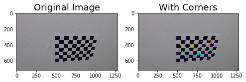

Using Open CV's function *cv2.calibrateCamera()* with objectpoints, imagepoints and image size get the calibration matrix and distortion coeffifients. 

* ###### Step 2 : Apply Distortion Correction
The calibration matrix and distortion coeffifients calculated in the step above are then passed to Open CV's function *cv2.undistort()* to undistort the image.

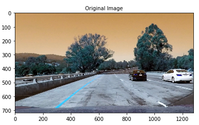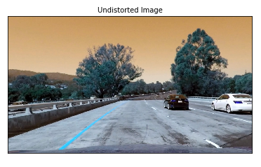

* ###### Step 3 : Create a threshold binary image
Color transforms and threshold gradients are then applied to the undistorted image to create a binary image. Binary image contains the representation of the image in binary 0s and 1s instead of Blue, Green and Red color. Applying the correct thresholds to the image makes it easier to remove noise and detect the lane pixels. After experimenting with various thresholds gradients for both x and y direction, applying thresholds on the magnitude and direction of the gradient and different color transforms I ended up applying thresholds on Lightness and Saturation over x direction. For this I had to transform the color from BGR to HSV using Open CV's function *cv2.cvtColor()*

Applying Lightness mask resulted in the following:

-----

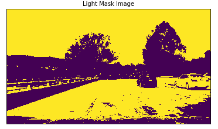

-----

Applying thresholds on Lightness transform over x direction:

------

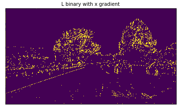

------

Applying threshold on Saturation transform over x direction:

-----

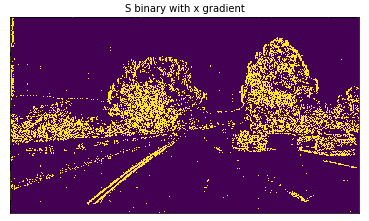

-----

The combined binary image resulted in better lane detection for lanes on tar roads, pavements and under shadows.
```python
combined[((lx_binary == 1) | (sx_binary == 1)) & (light_mask == 1)] = 1
```

* ###### Step 4 : Applying Perspective Transform
To detect lanes on the roads, the image is then wrapped. For this the *src* and *dst* array of points are calculated, keeping the region of interest (the lanes) under consideration. For y axis the cut off was set to 450, while for x axis 120 pixels were removed from both ends.


```python
src = np.float32(
        [(120, image_shape[0]),
         (x_center_off - 54, 450), 
         (x_center_off + 54, 450), 
         (image_shape[1] - 120, image_shape[0])])
    
    dst = np.float32(
        [(120, image_shape[1]),
         (120, 0),
         (image_shape[0] - 120, 0),
         (image_shape[0] - 120, image_shape[1])])
```

This resulted in the following source and destination points:

| Source        | Destination   | 
|:-------------:|:-------------:| 
| 120, 720      | 120, 1280     | 
| 586, 450      | 120, 0        |
| 694, 450      | 600, 0        |
| 1160, 720     | 600, 1280     |

I verified that my perspective transform was working as expected by drawing the `src` and `dst` points onto a test image and its warped counterpart to verify that the lines appear parallel in the warped image.

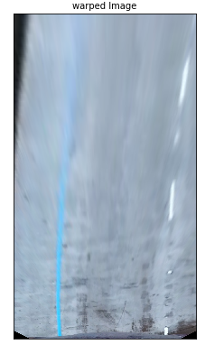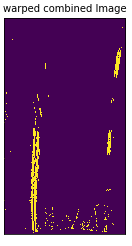

* ###### Step 5 : Detecting lane lines
The next step was to detect the lane line. This was done by first getting the histogram for the pixels within the wraped binary image.

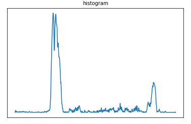

If the histogram is not noisy, there would be peaks in histogram associated with the lane pixels. Using *signal* module from scipy I was able to detect the two most prominent peaks in this histogram, one on the left of center and another on the right of the center on the histogram. These peaks corresponds to the x-position of the base for the lanes on the wrapped binary image.

Using the lanes pixels detected from the histogram as the starting point, identify and collect all the non zero pixels. This was achieved by using sliding windows search on the wrapped binary image.

Ones the non-zero pixel corresponding to the lanes have been detected, draw the line for the lanes. We use these pixels to fit the second order polynomial:

f(y) = Ay<sup>2</sup> + By + C

Here we are fitting for f(y), rather than f(x), because the lane lines in the warped image are near vertical and may have the same x value for more than one y value.

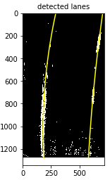

*Note : While working on the video, it is a good practice to use the averaged line fits of the current and a few previous fits*

* ###### Step 6 : Calculating the curvature of the lane and vehicle position with respect to center

Using the equation provided in the following [link](http://www.intmath.com/applications-differentiation/8-radius-curvature.php), the radius of curvature for the lanes was calculated. As the result was in pixels, the following conversions were done to get the radius in meters.

```python
    
    #Define conversions in x and y from pixels space to meters
    
    ym_per_pix = 30/ 720 # meters per pixel in y dimension
    xm_per_pix = 3.7/ 700 # meters per pixel in x dimension
    
    line_fit_cr = np.polyfit(ploty * ym_per_pix, linex * xm_per_pix, 2)
  
    #Calculate the new radius of curvature
    
    line_curverad = ((1 + (2*line_fit_cr[0] * y_eval * ym_per_pix + line_fit_cr[1])**2)**1.5) / np.absolute(2*line_fit_cr[0])
    
```

The position of the the vehicle with respect to the center was measured by taking the average of the x intercepts of left and right line.

* ###### Step 7 : Warp the detected lane boundaries back onto the original image

The image was then un-wrapped using the transformation matrix calculated using Open CV's function *cv2.getPerspectiveTransform()* now using original *dst* points as the source points and *src* points as the destination points.

* ###### Step 8 : Output visual display of the lane boundaries and numerical estimation of lane curvature and vehicle position

Fill the area between the lines on the un-wrapped image, and use it as an overlay over the original undistorted image.

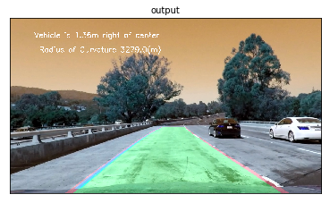

---

##  Project Video


[](http://www.youtube.com/watch?v=y9qcAGX6dm8)

---

## Discussion

During the development of the pipeline I encountered and fixed many issues while trying to find the gradient thresholds and correct color transforms that would work across bright, shadowed, normal roads and pavements. This took most of my time and it still needs improvement to work perfectly for hardest challenge.

The current solution does not detect the source and destination points automatically and are currently hardcoded. This can be improved by using the corners of the detected image and using it as a source points and come up with better strategy to identify the destination points. In current solution region of interest and calculation of destination points are merged, but these should be later separated out.

The current solution is not able to predict the lane pixels when the histogram is noisy. Noisy histogram can be result of cars overlapping lanes, bad weather, worn out lanes, etc. This I believe can be achieved by using the past history and past learning about all the x, y pixels. 

Also, situations where the lane is curving twice in different directions within the same image is not handled by the solution. 